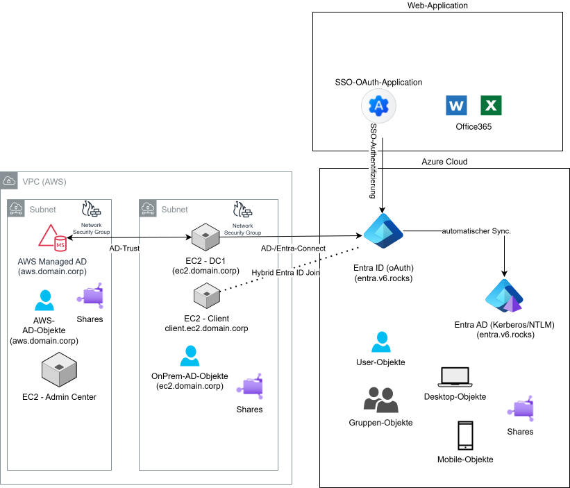
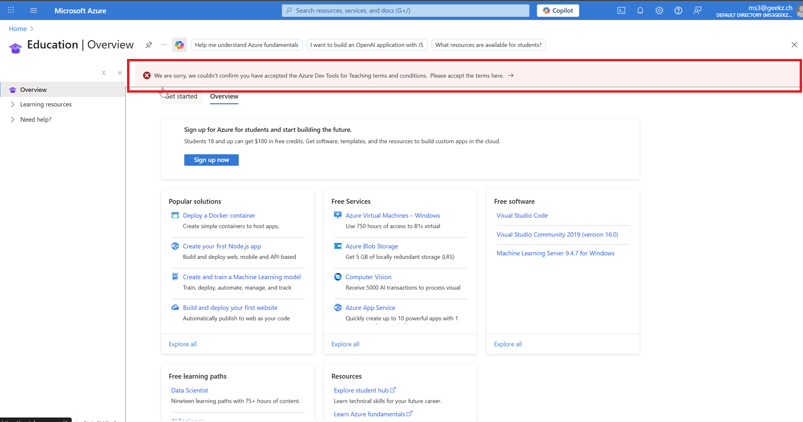

# M159 - Projekt-Setup-Sheet

In diesem Dokument werden sämtliche Angaben sowie Passwörter, welche Sie für die Installation Ihrer Umgebung benötigen, festgehalten.

---

## 1. Übersicht Umgebung

Diese Umgebung umfasst:

- **1x Windows Server (DC)** auf AWS EC2  
- **1x Windows Server (Client)** auf AWS EC2 (da AWS keine Windows Clients anbietet)  
- **1x Windows Server (Admin Center)** auf AWS EC2 zur Verwaltung der AWS Managed AD  
- **AWS Managed AD** mit Trust zur On-Premises(EC2) AD  
- **Entra Connect** zur Synchronisation mit Entra ID sowie Entra AD  
- **Lokale AD-Domain** (zu Beginn), später **öffentliche Domain als UPN**  

---

## 2. Allgemeine Angaben

| Feld                                | Wert |
| ----------------------------------- | ---- |
| Vorname                             |      |
| Nachname                            |      |
| Klasse                              |      |
| Dokumentation (GIT-Repository-Link) |      |

---

## 3. Ressourcen

| Feld                                                         | Wert                                            |
| ------------------------------------------------------------ | ----------------------------------------------- |
| Active Directory Second-Level-Domäne                         | Ihre fiktive oder reale Domäne für die Umgebung |
| Geplante öffentliche Domain (UPN) -> Registrieren Sie einen Namen unter https://dynv6.com/ |                                                 |
| Azure Education Account mit 80$ ([Anleitung für Freischaltung neuer Azure for Students Account (nicht TBZ-E-Mail)](../../../02-unterrichtsressourcen/03-fachliteratur-tutorials/azure/Azure-for-Students-Anleitung/Anleitung-Azure-for-Students.md)) (Wenn Sie Ihre private E-Mail-Adresse nicht verwenden möchten, können Sie beispielsweise eine Gmail-Adresse erstellen.) |                                                 |
|                                       |                                                 |
| Azure Education Account Passwort                             |                                                 |

---

## 4. AWS VPC Setup

**Hinweis:**  
Alle Instanzen liegen in einem öffentlichen Subnetz und sind über RDP (Port 3389) von außen erreichbar.  
Alle weiteren Ports sind nur innerhalb des VPCs offen.  

| Komponente                      | VPC-ID                | CIDR        | Name |
| ------------------------------- | --------------------- | ----------- | ---- |
| VPC                             | vpc-0470f613e45697700 | 10.0.0.0/16 |      |
| M159-subnet-private1-us-east-1a |                       |             |      |
| M159-subnet-private2-us-east-1b |                       |             |      |
| M159-subnet-public1-us-east-1a  |                       |             |      |
| M159-subnet-public2-us-east-1b  |                       |             |      |

---

## 5. AWS Sicherheitsgruppen

### Sicherheitsgruppe für Domain Controller

| Regeltyp                     | Port(e)                 | Quelle  |
| ---------------------------- | ----------------------- | ------- |
| RDP                          | 3389  (TCP)             | 0.0.0.0 |
| LDAP                         | 389 (TCP/UDP)           |         |
| LDAPS                        | 636 (TCP)               |         |
| Kerberos                     | 88 (TCP/UDP)            |         |
| SMB                          | 445  (TCP)              |         |
| DNS                          | 53 (TCP/UDP)            |         |
| RPC                          | 135, 49152-65535  (TCP) |         |
| ICMP                         | Alle                    |         |
| Global Catalog               | 3268 (TCP)              |         |
| Global Catalog SSL           | 3269 (TCP)              |         |
| Kerberos Password Change/Set | 464 (TCP/UDP)           |         |
|                              |                         |         |

### Sicherheitsgruppe für Clients

| Regeltyp | Port(e)     | Beschreibung                             | Quelle                                           |
| -------- | ----------- | ---------------------------------------- | ------------------------------------------------ |
| RDP      | 3389        | Remote Desktop                           | 0.0.0.0                                          |
| TCP      | 88          | Kerberos Authentication                  | 10.0.0.0/20  10.0.128.0/20 10.0.144.0/20 |
| TCP      | 135         | RPC Endpoint Mapper                      | 10.0.0.0/20  10.0.128.0/20 10.0.144.0/20 |
| TCP      | 139         | NetBIOS Session Service                  | 10.0.0.0/20  10.0.128.0/20 10.0.144.0/20 |
| TCP      | 389         | LDAP                                     | 10.0.0.0/20  10.0.128.0/20 10.0.144.0/20 |
| UDP      | 53          | DNS                                      | 10.0.0.0/20  10.0.128.0/20 10.0.144.0/20 |
| TCP      | 445         | SMB/CIFS (Dateifreigabe, AD-Operationen) | 10.0.0.0/20  10.0.128.0/20 10.0.144.0/20 |
| TCP      | 49152-65535 | RPC Ephemeral Ports                      | 10.0.0.0/20  10.0.128.0/20 10.0.144.0/20 |
| ICMP     | Alle        | Ping etc.                                | 10.0.0.0/20  10.0.128.0/20 10.0.144.0/20 |

---

## 6. Active Directory Umgebung

### On-Premises Active Directory (AWS EC2)

| Feld                                  | Wert                  |
| ------------------------------------- | --------------------- |
| Active Directory Third-Level-Domäne-1 | z.b. ec2.tbz.m159     |
| Öffentlicher UPN-Suffix (später)      | z.b. m159tbz.v6.rocks |
| Domänenadministrator                  | Administrator         |
| Kennwort Domänenadministrator         |                       |
| Kennwort-Demote (Herunterstufen)      |                       |

### Azure AD (Entra ID)

| Feld                             | Wert |
| -------------------------------- | ---- |
| Entra ID Domain                  |      |
| Azure Global Administrator       |      |
| Kennwort Azure Administrator     |      |
| Entra Connect Server (DC aus AD) |      |

### AWS Managed AD

| Feld                                  | Wert                                                 |
| ------------------------------------- | ---------------------------------------------------- |
| Active Directory Third-Level-Domäne-2 | z.b. aws.tbz.m159                                    |
| Trust-Typ                             | Tree-Root Trust                                      |
| AWS Managed Admin User                | admin                                                |
| AWS Managed Admin Passwort            |                                                      |
| DNS-Server 1                          |                                                      |
| DNS-Server 2                          |                                                      |
| Trust Passwort                        |                                                      |
| Subnetz 1                             | z.b. M159-subnet-private1-us-east-1a (10.0.128.0/20) |
| Subnetz 2                             | z.b. M159-subnet-private2-us-east-1b (10.0.144.0/20) |

---

## 7. EC2-Instanzen

| Komponente                  | FQDN                     | Elastic IP         | Private IP (CIDR) | Subnetz                         | DNS-Server 1 | DNS-Server 2 | Lokaler Admin | Kennwort |
| --------------------------- | ------------------------ | ------------------ | ----------------- | ------------------------------- | ------------ | ------------ | ------------- | -------- |
| IaaS/OnPrem AD DC           | z.b. dc.ec2.tbz.m159     |                    | z.b.  10.0.129.10 | M159-subnet-private1-us-east-1a |              |              | Administrator |          |
| Windows Server (Client)     | z.b. client.ec2.tbz.m159 | z.b. 44.198.134.36 | z.b.  10.0.129.20 | M159-subnet-public1-us-east-1a  |              |              | Administrator |          |
| Windows Server Admin Center |                          |                    |                   |                                 |              |              |               |          |

---

## 8. Abteilungen & Benutzer

Definieren Sie je einen Benutzer dieser 3 Abteilungen 

| Abteilung | Name der Abteilung | Benutzername | Vorname | Nachname | Kennwort | Bereiche |
| --------- | ------------------ | ------------ | ------- | -------- | -------- | -------- |
| 1         | Sekretariat        |              |         |          |          | intern   |
| 2         | Buchhaltung        |              |         |          |          | intern   |
| 3         | GL                 |              |         |          |          | intern   |
| 4         | Promoter           |              |         |          |          | extern   |

## 09. Python-App-Registration (Entra-ID)

| Name                    | Wert |
| ----------------------- | ---- |
| Directory (tenant) ID   |      |
| Application (client) ID |      |
| Client Secret ID        |      |

## 10. Hinweise

- Beginnen Sie mit der lokalen Domain-Umgebung und konfigurieren Sie **später den UPN-Suffix** mit der öffentlichen Domain.  
- Achten Sie auf **richtige Portfreigaben** in den AWS Sicherheitsgruppen, insbesondere für RDP, SMB und AD-Dienste.  
- Dokumentieren Sie alle IP-Adressen, Benutzernamen und Kennwörter konsequent in dieser Vorlage.
- Diese Vorlage wurde für das Schuljahr 2025/26 komplett neu erstellt. Falls Ihnen etwas fehlt, ist die Lehrperson dankbar, wenn Sie ihr dies mitteilen.