# Initial Setup – dc1, client1, adminctr1

Dokumentation der Grundkonfiguration der drei Windows-Server in AWS. Aufgabenstellung siehe
[Modul-Repository](https://gitlab.com/ch-tbz-it/Stud/m159/-/tree/main/03-auftraege/02-initial-setup).

Autor: Giacomo Betsch, Klasse Pe24d

## 1. Umgebung

- AWS Academy Learner Lab (Vocareum), Region us-east-1
- Drei Windows-Server (EC2): `dc1`, `client1`, `adminctr1`
- Geplante Adressen (siehe [Planung](../01-planung/planung.md)): dc1 `10.0.0.10`, client1 `10.0.0.20`
- Zugriff per Remotedesktop (`mstsc`) auf die öffentliche IPv4-Adresse, Benutzer `Administrator`.
  Das Passwort wird in der EC2-Konsole über "Windows-Passwort abrufen" mit dem Schlüssel
  (.pem) entschlüsselt. Passwörter stehen nicht in diesem Repository.

Hinweis zum Lab: Läuft die Lab-Session ab, verweigert die AWS-Konsole plötzlich alles
(Fehlermeldung mit `explicit deny`, Rolle `voclabs`). Das ist kein Serverfehler. Lösung: auf
der Vocareum-Seite das Lab neu starten ("Start Lab"), warten bis es aktiv ist und die
Konsole neu öffnen. Die Instanzen bleiben dabei bestehen.

## 2. Sicherheitsgruppen

Für die Server habe ich zwei Sicherheitsgruppen erstellt, jeweils mit den Ports, die
Active Directory braucht (RDP, DNS, LDAP/LDAPS, Kerberos, SMB, RPC, Global Catalog, ICMP).

Domain Controller (`m159-dc-sg`, 16 eingehende Regeln):

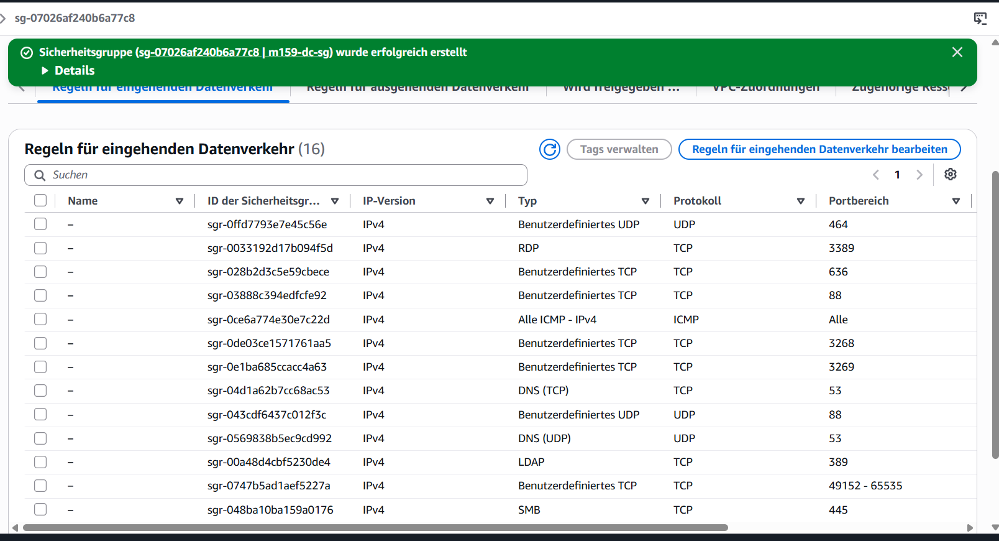

Client (`m159-client-sg`, 9 eingehende Regeln):

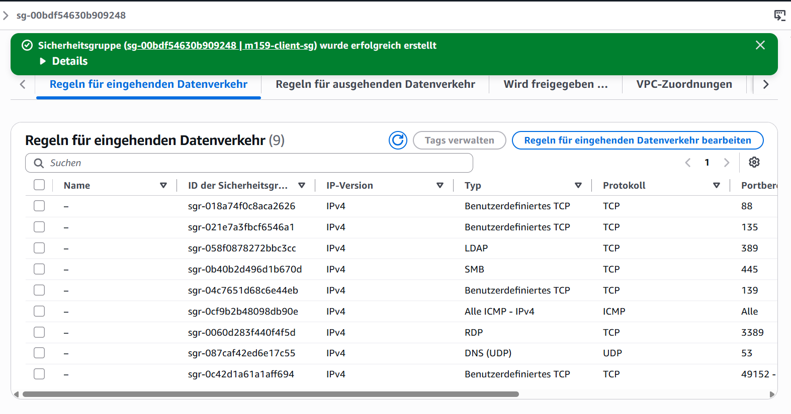

## 3. Instanzen

Die drei Server laufen als EC2-Instanzen vom Typ `t3.micro`. In der EC2-Konsole sind alle
drei im Zustand "Läuft" und haben 3/3 bestandene Statusprüfungen. dc1 und client1 liegen in
der Availability Zone us-east-1a, adminctr1 in us-east-1b:

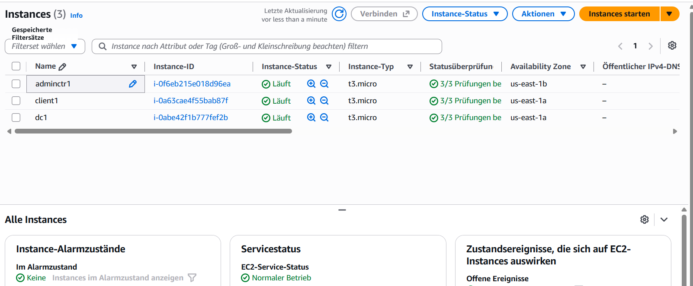

dc1 läuft mit Windows Server 2025 Datacenter und der privaten Adresse `10.0.0.10`, client1
hat die private Adresse `10.0.0.20`.

Die öffentlichen Adressen ändern sich nach jedem Lab-Neustart, weil keine Elastic IP
vergeben ist. Für den Zugriff nehme ich deshalb jeweils die aktuelle Adresse aus der
EC2-Konsole.

## 4. Grundkonfiguration der Server

Die folgenden Einstellungen habe ich auf den Servern vorgenommen. Befehle liefen in einer
PowerShell mit Administratorrechten.

### 4.1 Hostname

`Rename-Computer -NewName "<name>"`, danach Neustart. dc1 im Server Manager (Local Server)
mit dem Computernamen `dc1` in der Arbeitsgruppe `WORKGROUP`; das Betriebssystem ist
Windows Server 2025 Datacenter auf einer EC2-Instanz `t3.micro`:

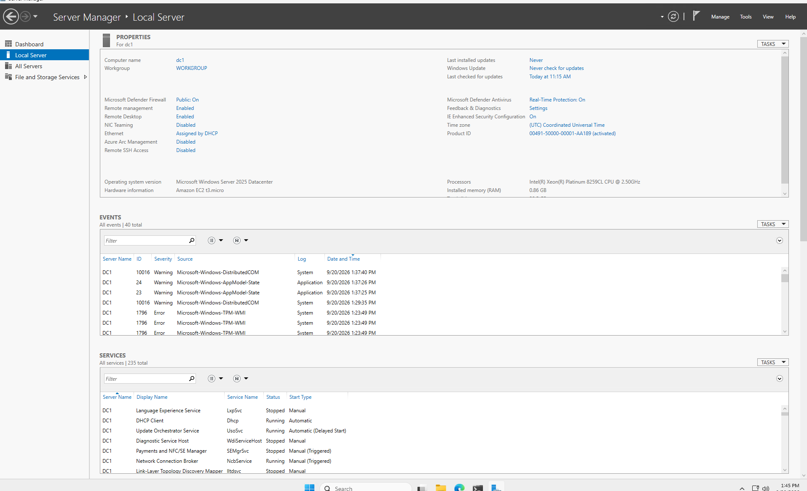

Auf dem Desktop von dc1 zeigt die Bildschirmeinblendung Hostname `dc1`, die private Adresse
`10.0.0.10` und die Availability Zone `us-east-1a`. Das belegt, dass es meine Umgebung ist:

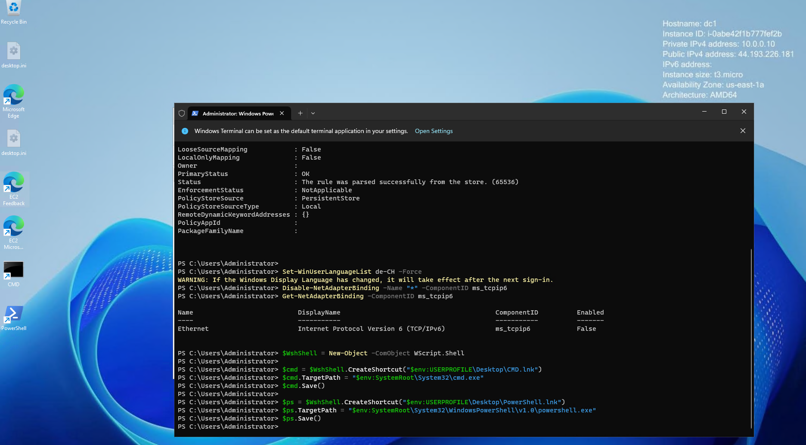

### 4.2 Ping erlauben

Eine Firewallregel erlaubt eingehende ICMPv4-Echo-Anfragen:

```powershell
New-NetFirewallRule -DisplayName "Allow ICMPv4 Ping" `
  -Protocol ICMPv4 -IcmpType 8 -Direction Inbound -Action Allow
```

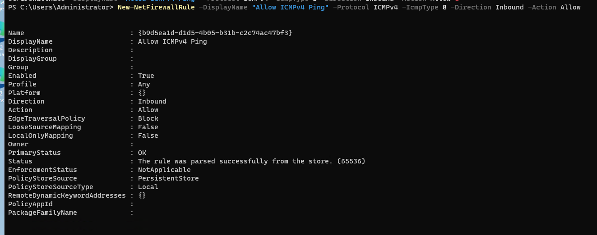

### 4.3 Tastaturlayout Deutsch (Schweiz)

```powershell
Set-WinUserLanguageList de-CH -Force
```

Windows weist darauf hin, dass die Anzeigesprache erst nach der nächsten Anmeldung
wirksam wird (Warnung im PowerShell-Fenster auf den Bildern unten).

### 4.4 IPv6 deaktivieren

```powershell
Disable-NetAdapterBinding -Name "*" -ComponentID ms_tcpip6
Get-NetAdapterBinding -ComponentID ms_tcpip6
```

Die Kontrolle zeigt `Enabled = False`:

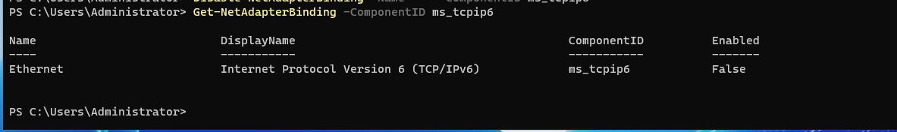

### 4.5 CMD und PowerShell auf dem Desktop

Zwei Verknüpfungen habe ich per Skript angelegt:

```powershell
$ws = New-Object -ComObject WScript.Shell
$cmd = $ws.CreateShortcut("$env:USERPROFILE\Desktop\CMD.lnk")
$cmd.TargetPath = "$env:SystemRoot\System32\cmd.exe"
$cmd.Save()
$ps = $ws.CreateShortcut("$env:USERPROFILE\Desktop\PowerShell.lnk")
$ps.TargetPath = "$env:SystemRoot\System32\WindowsPowerShell\v1.0\powershell.exe"
$ps.Save()
```

Ablauf dieser Befehle inklusive IPv6-Kontrolle auf zwei weiteren Servern:

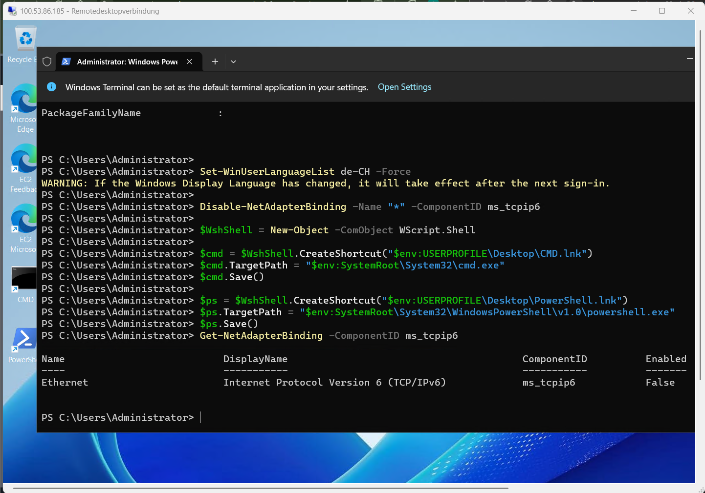

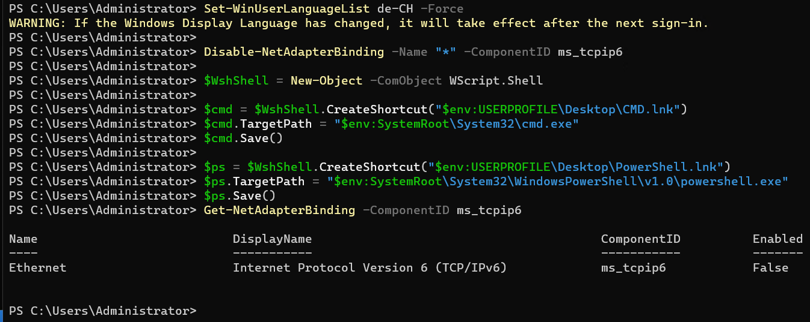

### 4.6 IE Enhanced Security ausschalten

Im Server Manager unter *Local Server → IE Enhanced Security Configuration* habe ich die
Einstellung für Administratoren und Benutzer auf `Off` gestellt. Die Kontrolle auf dc1 zeigt
`Off`. Die öffentliche Adresse in der Titelleiste hat sich gegenüber früheren Bildern
geändert, weil die Instanzen keine Elastic IP haben und die Adresse nach einem
Lab-Neustart wechselt:

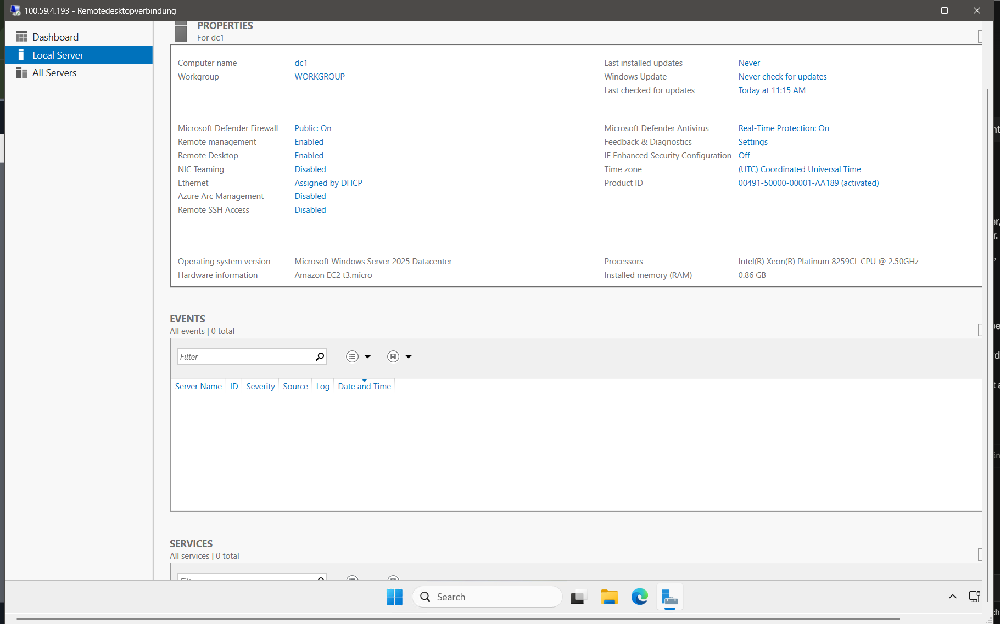

### 4.7 Explorer-Optionen

Im Explorer unter *Options → View* habe ich versteckte Dateien und Ordner eingeblendet und
die Dateiendungen bekannter Dateitypen angezeigt. Beim Einblenden der geschützten
Systemdateien fragt Windows nach einer Bestätigung:

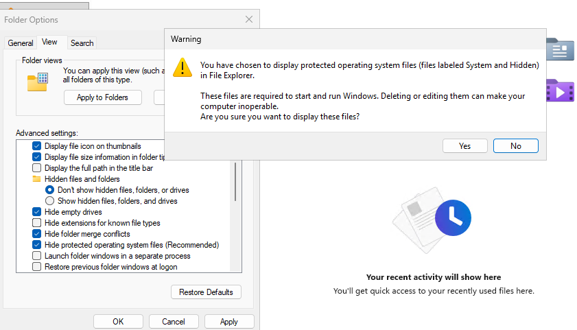

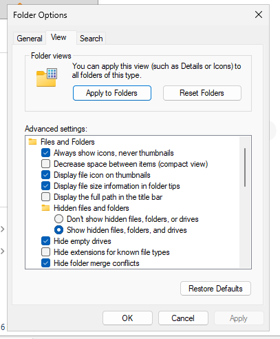

### 4.8 Desktop-Symbole

Über *Personalize → Themes → Desktop icon settings* habe ich Computer (This PC),
Control Panel und Network eingeblendet:

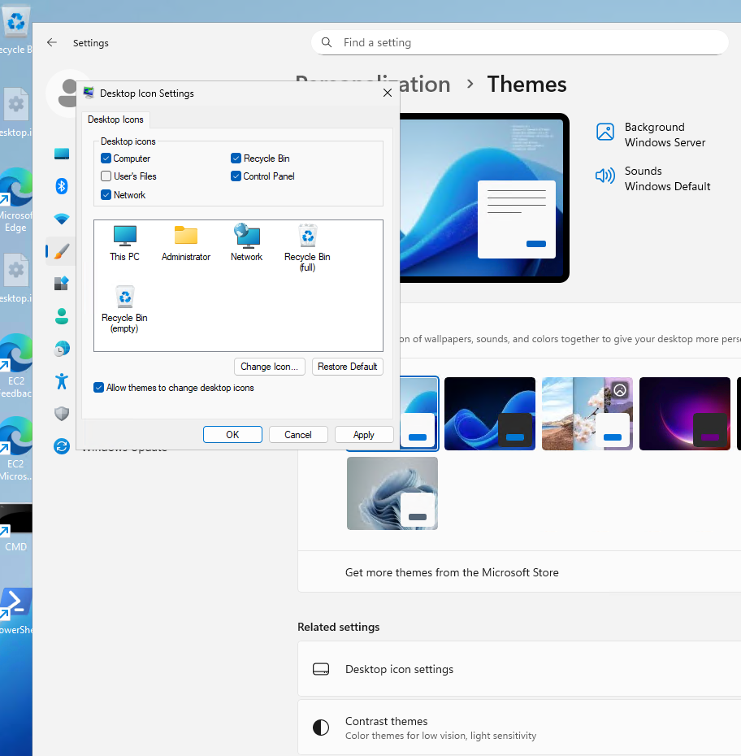

Der Dialog im Detail, mit angehakten Symbolen Computer (This PC), Control Panel und Network:

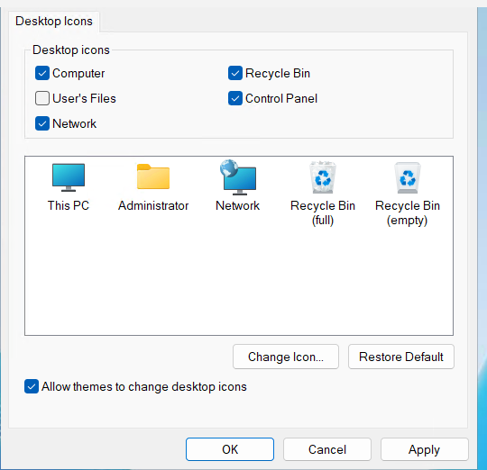

### 4.9 Neustart

Nach den Einstellungen habe ich jeden Server neu gestartet, damit Hostname und Tastaturlayout
sicher übernommen sind.

### 4.10 Administrator-Passwort ändern

Das von AWS vergebene Administrator-Passwort habe ich durch ein eigenes ersetzt. Dafür habe
ich in der PowerShell `net user Administrator *` ausgeführt, das neue Passwort zweimal
eingegeben (die Eingabe bleibt unsichtbar) und die Bestätigung erhalten:

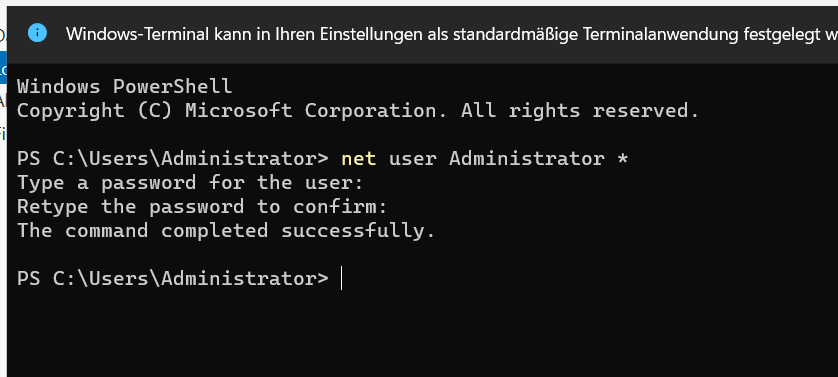

Das neue Passwort steht nicht in diesem Repository.

## 5. Kontrolle client1

Auf client1 habe ich die Einstellungen mit Abfragen geprüft: Hostname `client1`, Sprache
`de-CH`, IPv6 `Enabled = False`, private Adresse `10.0.0.20`, Firewallregel
`Allow ICMPv4 Ping` aktiv. Ein Ping auf dc1 (`10.0.0.10`) wurde beantwortet:

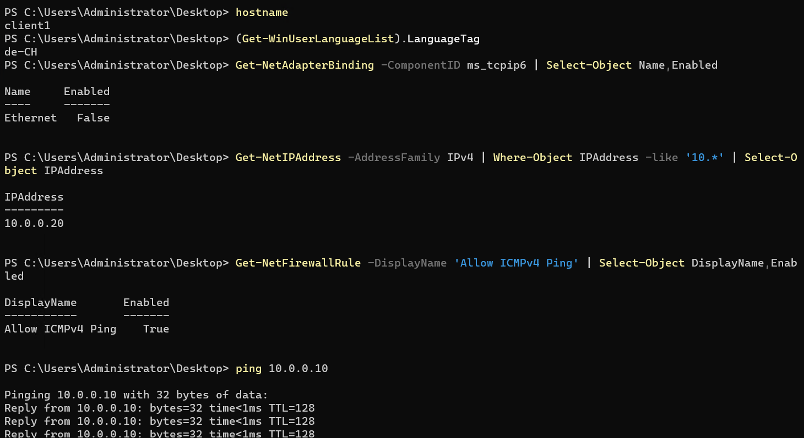

Der Ping mit vollständiger Statistik (3 von 3 Paketen, 0 % Verlust):

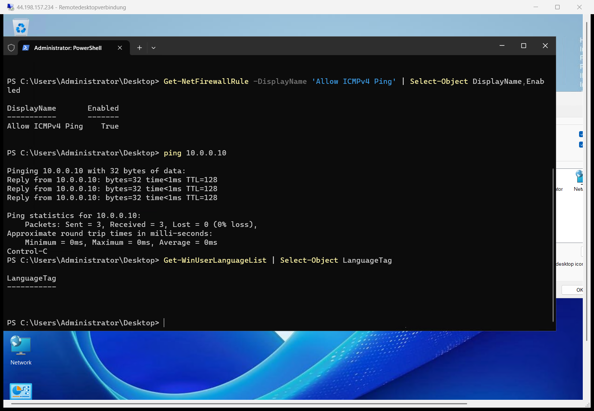
