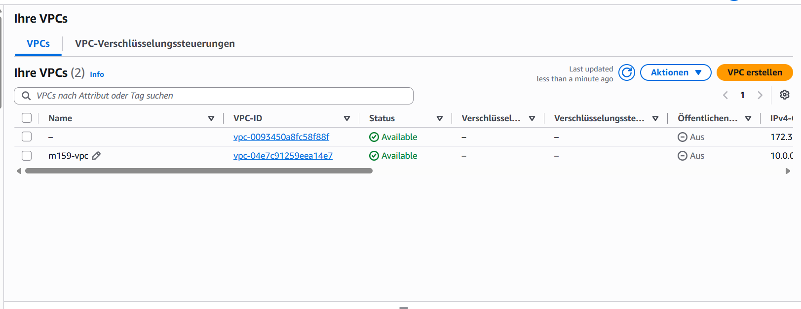
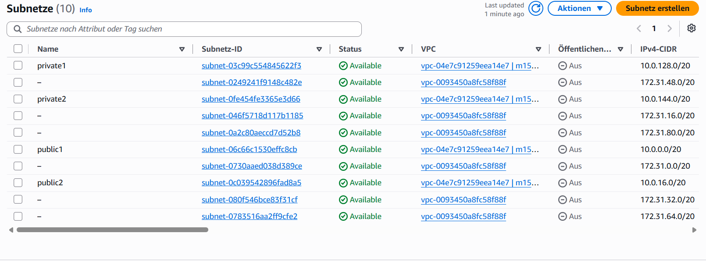
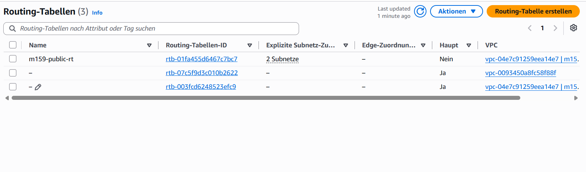

# Initial Setup – dc1, client1, adminctr1

Dokumentation der Grundkonfiguration der drei Windows-Server in AWS. Aufgabenstellung siehe
[Modul-Repository](https://gitlab.com/ch-tbz-it/Stud/m159/-/tree/main/03-auftraege/02-initial-setup).

Autor: Giacomo Betsch, Klasse Pe24d

## 1. Umgebung

- AWS Academy Learner Lab (Vocareum), Region us-east-1
- Drei Windows-Server (EC2): `dc1`, `client1`, `adminctr1`
- Geplante Adressen (siehe [Planung](../01-planung/planung.md)): dc1 `10.0.0.10`, client1 `10.0.0.20`
- Zugriff per Remotedesktop (`mstsc`) auf die öffentliche IPv4-Adresse, Benutzer `Administrator`.
  Das Passwort wird in der EC2-Konsole über "Windows-Passwort abrufen" mit dem Schlüssel
  (.pem) entschlüsselt. Passwörter stehen nicht in diesem Repository.

Hinweis zum Lab: Läuft die Lab-Session ab, verweigert die AWS-Konsole plötzlich alles
(Fehlermeldung mit `explicit deny`, Rolle `voclabs`). Das ist kein Serverfehler. Lösung: auf
der Vocareum-Seite das Lab neu starten ("Start Lab"), warten bis es aktiv ist und die
Konsole neu öffnen. Die Instanzen bleiben dabei bestehen.

## 2. VPC und Subnetze

Ich habe eine eigene VPC `m159-vpc` mit dem Adressbereich `10.0.0.0/16` angelegt, getrennt von
der Standard-VPC des Labs (`172.31.0.0/16`):



In der VPC liegen vier Subnetze, zwei öffentliche und zwei private, mit den in der
[Planung](../01-planung/planung.md) vorgesehenen Adressbereichen:

| Subnetz | IPv4-CIDR |
| --- | --- |
| public1 | 10.0.0.0/20 |
| public2 | 10.0.16.0/20 |
| private1 | 10.0.128.0/20 |
| private2 | 10.0.144.0/20 |



Für die öffentlichen Subnetze gibt es die Routing-Tabelle `m159-public-rt`, der zwei Subnetze
explizit zugeordnet sind:



## 3. Sicherheitsgruppen

Für die Server habe ich zwei Sicherheitsgruppen erstellt, jeweils mit den Ports, die
Active Directory braucht (RDP, DNS, LDAP/LDAPS, Kerberos, SMB, RPC, Global Catalog, ICMP).

Domain Controller (`m159-dc-sg`, 16 eingehende Regeln):


Client (`m159-client-sg`, 9 eingehende Regeln):


## 4. Instanzen

Die drei Server laufen als EC2-Instanzen vom Typ `t3.micro`. In der EC2-Konsole sind alle
drei im Zustand "Läuft" und haben 3/3 bestandene Statusprüfungen. dc1 und client1 liegen in
der Availability Zone us-east-1a, adminctr1 in us-east-1b:


dc1 läuft mit Windows Server 2025 Datacenter und der privaten Adresse `10.0.0.10`, client1
hat die private Adresse `10.0.0.20`.

Die öffentlichen Adressen ändern sich nach jedem Lab-Neustart, weil keine Elastic IP
vergeben ist. Für den Zugriff nehme ich deshalb jeweils die aktuelle Adresse aus der
EC2-Konsole.

## 5. Grundkonfiguration der Server

Die folgenden Einstellungen habe ich auf allen drei Servern (dc1, client1, adminctr1)
vorgenommen. Befehle liefen in einer PowerShell mit Administratorrechten. Die Bilder zeigen
jeweils einzelne Server als Beispiel, die Schritte waren auf allen Servern identisch.

### 5.1 Hostname

Jeden Server habe ich mit `Rename-Computer -NewName "<name>"` so benannt wie seine
EC2-Instanz (`dc1`, `client1`, `adminctr1`) und danach neu gestartet. dc1 im Server Manager (Local Server)
mit dem Computernamen `dc1` in der Arbeitsgruppe `WORKGROUP`; das Betriebssystem ist
Windows Server 2025 Datacenter auf einer EC2-Instanz `t3.micro`:


Auf dem Desktop von dc1 zeigt die Bildschirmeinblendung Hostname `dc1`, die private Adresse
`10.0.0.10` und die Availability Zone `us-east-1a`. Das belegt, dass es meine Umgebung ist:


### 5.2 Ping erlauben

Auf allen drei Servern erlaubt eine Firewallregel eingehende ICMPv4-Echo-Anfragen:

```powershell
New-NetFirewallRule -DisplayName "Allow ICMPv4 Ping" `
  -Protocol ICMPv4 -IcmpType 8 -Direction Inbound -Action Allow
```


### 5.3 Tastaturlayout Deutsch (Schweiz)

```powershell
Set-WinUserLanguageList de-CH -Force
```

Das habe ich auf allen drei Servern gemacht. Windows weist darauf hin, dass die
Anzeigesprache erst nach der nächsten Anmeldung wirksam wird (Warnung im PowerShell-Fenster
auf den Bildern unten). Auf client1 zeigt die Kontrolle `de-CH` (siehe Abschnitt 6).

### 5.4 IPv6 deaktivieren

```powershell
Disable-NetAdapterBinding -Name "*" -ComponentID ms_tcpip6
Get-NetAdapterBinding -ComponentID ms_tcpip6
```

Das habe ich auf allen drei Servern gemacht. Die Kontrolle zeigt jeweils `Enabled = False`:


### 5.5 CMD und PowerShell auf dem Desktop

Auf allen drei Servern habe ich zwei Verknüpfungen (CMD und PowerShell) per Skript angelegt:

```powershell
$ws = New-Object -ComObject WScript.Shell
$cmd = $ws.CreateShortcut("$env:USERPROFILE\Desktop\CMD.lnk")
$cmd.TargetPath = "$env:SystemRoot\System32\cmd.exe"
$cmd.Save()
$ps = $ws.CreateShortcut("$env:USERPROFILE\Desktop\PowerShell.lnk")
$ps.TargetPath = "$env:SystemRoot\System32\WindowsPowerShell\v1.0\powershell.exe"
$ps.Save()
```

Ablauf dieser Befehle inklusive IPv6-Kontrolle auf zwei weiteren Servern:


### 5.6 IE Enhanced Security ausschalten

Im Server Manager unter *Local Server → IE Enhanced Security Configuration* habe ich die
Einstellung für Administratoren und Benutzer auf `Off` gestellt, auf allen drei Servern. Die
Kontrolle auf dc1 zeigt `Off`. Die öffentliche Adresse in der Titelleiste hat sich gegenüber früheren Bildern
geändert, weil die Instanzen keine Elastic IP haben und die Adresse nach einem
Lab-Neustart wechselt:


### 5.7 Explorer-Optionen

Im Explorer unter *Options → View* habe ich auf allen drei Servern folgende Einstellungen
geändert:

- «Hide extensions for known file types» deaktiviert, damit Dateiendungen sichtbar sind
- «Use Sharing Wizard» deaktiviert
- «Hide protected operating system files» deaktiviert und «Show hidden files, folders, and
  drives» aktiviert, damit alle Dateien angezeigt werden

Beim Einblenden der geschützten Systemdateien fragt Windows nach einer Bestätigung:


### 5.8 Desktop-Symbole

Über *Personalize → Themes → Desktop icon settings* habe ich auf allen drei Servern Computer
(This PC), Control Panel und Network eingeblendet:


Der Dialog im Detail, mit angehakten Symbolen Computer (This PC), Control Panel und Network:


### 5.9 Neustart

Nach den Einstellungen habe ich alle drei Server neu gestartet, damit Hostname und Tastaturlayout
sicher übernommen sind.

### 5.10 Administrator-Passwort ändern

Das von AWS vergebene Administrator-Passwort habe ich durch ein eigenes ersetzt. Dafür habe
ich in der PowerShell `net user Administrator *` ausgeführt, das neue Passwort zweimal
eingegeben (die Eingabe bleibt unsichtbar) und die Bestätigung erhalten:


Das neue Passwort steht nicht in diesem Repository.

## 6. Kontrolle client1

Auf client1 habe ich die Einstellungen mit Abfragen geprüft: Hostname `client1`, Sprache
`de-CH`, IPv6 `Enabled = False`, private Adresse `10.0.0.20`, Firewallregel
`Allow ICMPv4 Ping` aktiv. Ein Ping auf dc1 (`10.0.0.10`) wurde beantwortet:


Der Ping mit vollständiger Statistik (3 von 3 Paketen, 0 % Verlust):


