# Gesamtstruktur (erster DC) und Client

Dokumentation zu Auftrag 03: dc1 wird zum ersten Domänencontroller einer neuen Gesamtstruktur,
client1 tritt der Domäne bei. Aufgabenstellung siehe
[Modul-Repository](https://gitlab.com/ch-tbz-it/Stud/m159/-/tree/main/03-auftraege/03-neue-gesamtstruktur-und-client).

Autor: Giacomo Betsch, Klasse Pe24d

Die Werte stammen aus meiner [Planung](../01-planung/planung.md):

| Wert | Inhalt |
| --- | --- |
| Domäne (DNS-Name) | `corp.m159giacomo.dynv6.net` |
| NetBIOS-Name | `CORP` |
| dc1 | `dc1.corp.m159giacomo.dynv6.net`, `10.0.0.10` |
| client1 | `client1.corp.m159giacomo.dynv6.net`, `10.0.0.20` |

Passwörter stehen nicht in diesem Repository.

## 1. AD-DS-Rolle auf dc1 hinzufügen

Die Rolle "Active Directory Domain Services" habe ich in einer PowerShell auf dc1 installiert.
Mein erster Versuch mit dem Namen `AD-DS` scheiterte, weil die Rolle `AD-Domain-Services` heisst.
Danach lief die Installation mit `Success True`, die Kontrolle zeigt `Installed`:

```powershell
Install-WindowsFeature AD-Domain-Services -IncludeManagementTools
Get-WindowsFeature AD-Domain-Services
```

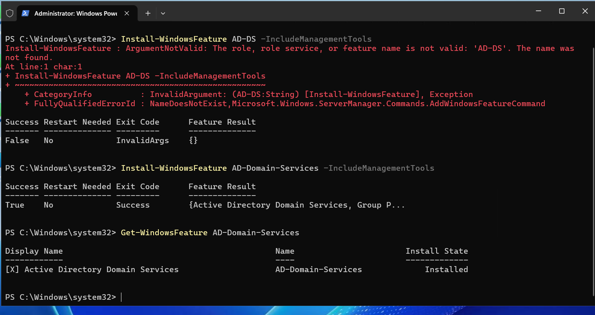

## 2. dc1 promoten: neue Gesamtstruktur

dc1 habe ich zum Domänencontroller einer neuen Gesamtstruktur gemacht. Die Standardspeicherorte
habe ich belassen. Das Kennwort für den Verzeichnisdienst-Wiederherstellungsmodus (DSRM) habe
ich bei der Abfrage selbst eingegeben, es ist ein anderes als das des Administrators.

```powershell
Install-ADDSForest -DomainName "corp.m159giacomo.dynv6.net" -DomainNetbiosName "CORP" -InstallDns
```

Nach dem automatischen Neustart zeigt die Kontrolle: Computer `DC1` in der Domäne
`corp.m159giacomo.dynv6.net` mit `DomainRole 5` (Domänencontroller), Global Catalog, Adresse
`10.0.0.10`, und die Dienste DNS, Netlogon und NTDS laufen:

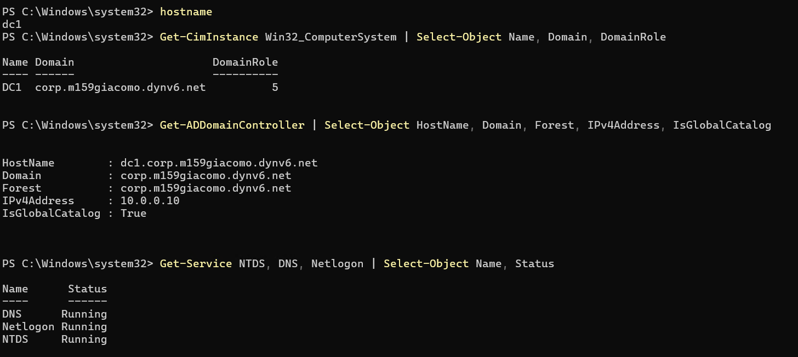

## 3. DNS

### Weiterleitung an 9.9.9.9

```powershell
Add-DnsServerForwarder -IPAddress 9.9.9.9
Get-DnsServerForwarder
```

Neben `9.9.9.9` steht `10.0.0.2` in der Liste. Das ist der DNS-Dienst von AWS in der VPC, den die
Promotion automatisch als Weiterleitung eingetragen hat.

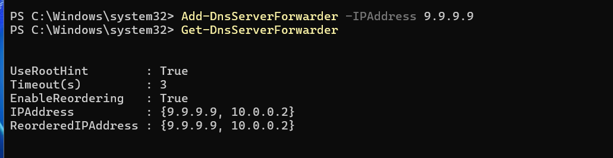

Warum 9.9.9.9 (Quad9) besser ist als 8.8.8.8 (Google):

- Quad9 blockiert Anfragen nach bekannten schädlichen Domains (Malware, Phishing). Für einen
  Domänencontroller, der Anfragen für alle Clients weiterleitet, ist das ein Schutz auf
  DNS-Ebene.
- Quad9 speichert keine IP-Adressen der Anfragenden, der Datenschutz ist besser.
- Quad9 wird von einer gemeinnützigen Stiftung mit Sitz in der Schweiz betrieben und
  unterliegt nicht dem Geschäftsmodell eines Werbekonzerns.

### Forward-Zone

Die Forward-Zone `corp.m159giacomo.dynv6.net` hat die Promotion automatisch angelegt (siehe
Zonenliste im nächsten Bild).

### Reverse-Zonen und PTR-Record

Ohne Reverse-Zone erhält man in AWS beim Rückwärts-Lookup einen falschen Namen. Ich habe
deshalb für die Adressbereiche, in denen meine Server liegen, Reverse-Zonen angelegt. Die
Subnetze sind `/20`, eine Reverse-Zone lässt sich in Windows aber nur an den Bytegrenzen
(`/24`) anlegen. Darum habe ich zwei `/24`-Zonen für public1 (`10.0.0.x`) und public2
(`10.0.16.x`) erstellt. In den privaten Subnetzen liegen noch keine eigenen Server.

```powershell
Add-DnsServerPrimaryZone -NetworkId "10.0.0.0/24" -ReplicationScope Domain
Add-DnsServerPrimaryZone -NetworkId "10.0.16.0/24" -ReplicationScope Domain
Add-DnsServerResourceRecordPtr -Name "10" -ZoneName "0.0.10.in-addr.arpa" -PtrDomainName "dc1.corp.m159giacomo.dynv6.net"
```

Die Zonenliste zeigt `0.0.10.in-addr.arpa` und `16.0.10.in-addr.arpa`, darunter der
PTR-Record für dc1:

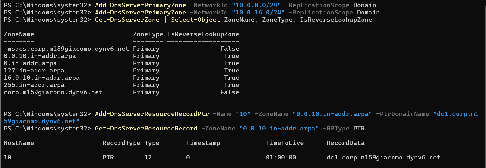

### NSLOOKUP vorwärts und rückwärts auf dc1

Beide Richtungen sind erfolgreich: der Name löst zu `10.0.0.10` auf und die Adresse zurück zu
`dc1.corp.m159giacomo.dynv6.net`:

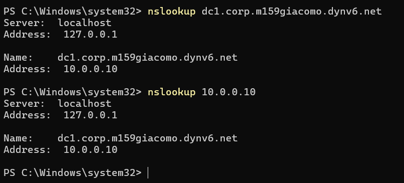

## 4. Diverse AD-Einstellungen: AD-Papierkorb

```powershell
Enable-ADOptionalFeature 'Recycle Bin Feature' -Scope ForestOrConfigurationSet -Target 'corp.m159giacomo.dynv6.net' -Confirm:$false
Get-ADOptionalFeature 'Recycle Bin Feature' | Select-Object Name, EnabledScopes
```

Windows warnt, dass sich das Aktivieren nicht rückgängig machen lässt. `EnabledScopes` ist
danach gefüllt, der Papierkorb ist aktiv:

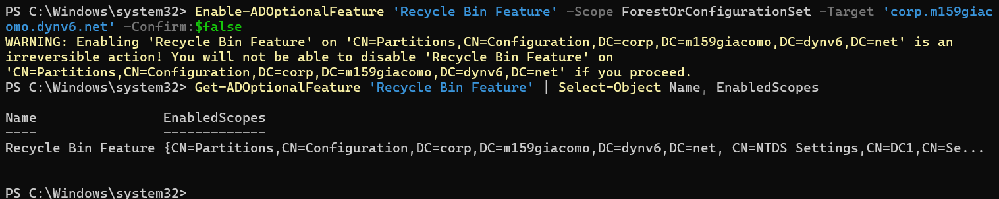

## 5. Client in die Domäne einbinden

### Vorbereitung: DNS

Auf client1 habe ich den DNS-Server auf den Domänencontroller gestellt. `ipconfig /all` zeigt
Hostname `client1`, Adresse `10.0.0.20` und DNS-Server `10.0.0.10`:

```powershell
Set-DnsClientServerAddress -InterfaceAlias "Ethernet" -ServerAddresses 10.0.0.10
```

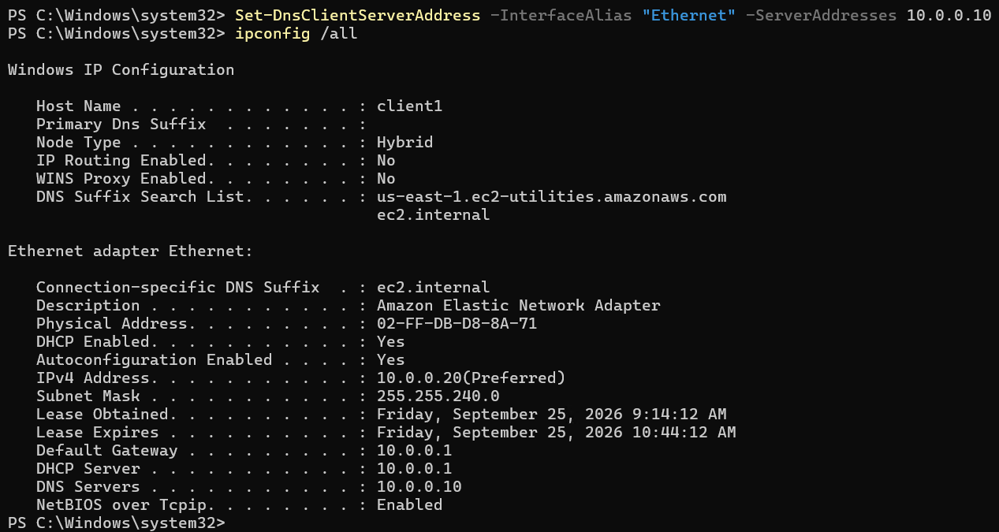

### Ports zum Domänencontroller testen (mit Fehleranalyse)

Getestet habe ich die Ports aus der Aufgabe (88, 135, 139, 389, 445):

```powershell
foreach ($p in 88,135,139,389,445) { Test-NetConnection -ComputerName dc1.corp.m159giacomo.dynv6.net -Port $p | Select-Object ComputerName, RemotePort, TcpTestSucceeded }
```

Beim ersten Test schlug **Port 139** fehl (`TcpTestSucceeded False`), alle anderen waren
erreichbar:

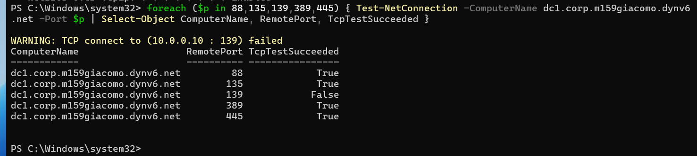

Ursache: In der Sicherheitsgruppe `m159-dc-sg` war TCP 139 nicht geöffnet, denn in meiner
Planung war er für den DC nicht vorgesehen. Ich habe in der AWS-Konsole eine eingehende Regel
hinzugefügt (Benutzerdefiniertes TCP, Port 139, Quelle `10.0.0.0/16`, wie bei den übrigen
AD-Ports). Danach sind alle fünf Ports erreichbar:

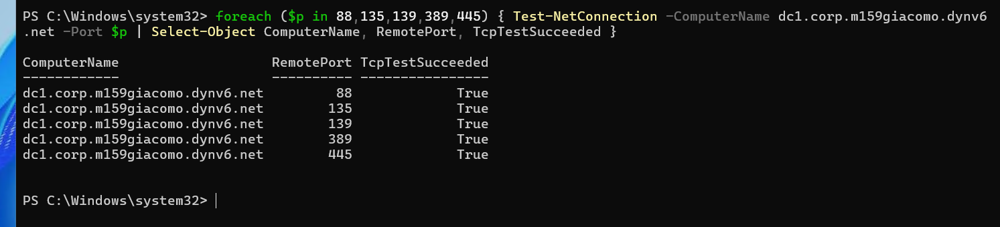

### Domänenbeitritt

```powershell
Add-Computer -DomainName "corp.m159giacomo.dynv6.net" -Credential CORP\Administrator -Restart
```

Das Domänen-Administrator-Passwort habe ich in der Anmeldeabfrage eingegeben. Nach dem
Neustart zeigt client1 den Hostnamen `client1` und ist Mitglied der Domäne
`corp.m159giacomo.dynv6.net` (`PartOfDomain True`):

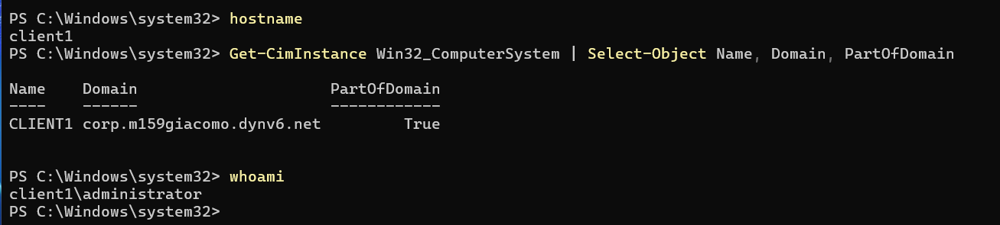

Auf dc1 erscheint das Computerobjekt `CLIENT1` in *Active Directory-Benutzer und -Computer*
im Standardordner *Computers*:

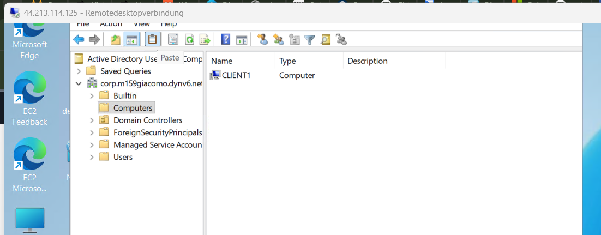

### PTR-Record von client1 und NSLOOKUP

```powershell
Add-DnsServerResourceRecordPtr -Name "20" -ZoneName "0.0.10.in-addr.arpa" -PtrDomainName "client1.corp.m159giacomo.dynv6.net"
Get-DnsServerResourceRecord -ZoneName "0.0.10.in-addr.arpa" -RRType PTR
```

Die Reverse-Zone enthält jetzt die PTR-Records für dc1 (`10`) und client1 (`20`). NSLOOKUP
funktioniert für den Client in beide Richtungen:

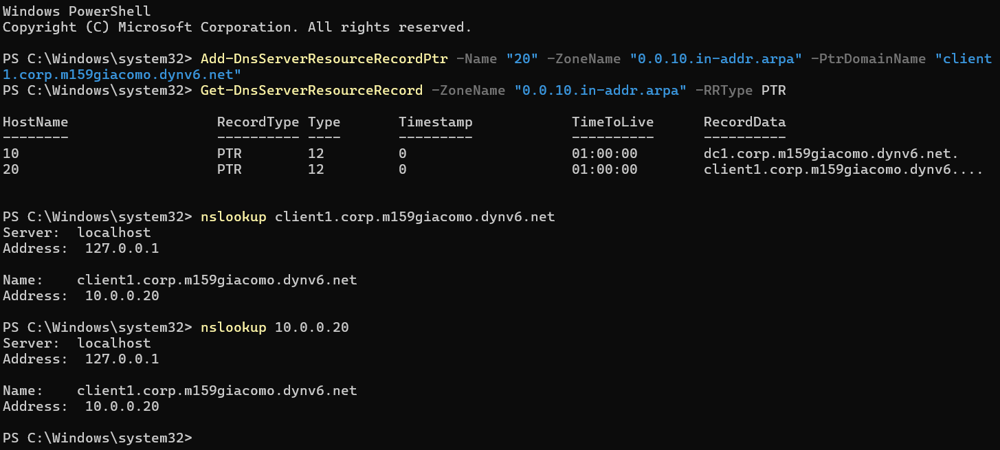

### Anmeldeformen

| Form | Beispiel | Anmeldung |
| --- | --- | --- |
| `.\Logonname` | `.\Administrator` | lokal am Client |
| `Computername\Logonname` | `client1\Administrator` | lokal am Client |
| `Domain\Logonname` | `CORP\Administrator` | an der Domäne über den NetBIOS-Namen |
| `Logonname@Domain` | `Administrator@corp.m159giacomo.dynv6.net` | an der Domäne über den DNS-Namen |

## 6. Remote Desktop als Admin und User (RDP-Konzept)

Administratoren dürfen sich per RDP auf einem Client anmelden, normale Benutzer nur mit
ausdrücklicher Berechtigung. Statt jeden Benutzer einzeln einzutragen, habe ich zwei
Sicherheitsgruppen in der Domäne angelegt:

| Gruppe | Zweck | Lokale Zuweisung auf dem Client |
| --- | --- | --- |
| `RDP-Admins` | RDP-Zugriff mit Administratorrechten | Mitglied der lokalen Gruppe *Administrators* |
| `RDP-Users` | RDP-Zugriff als normaler Benutzer | Mitglied der lokalen Gruppe *Remote Desktop Users* |

```powershell
New-ADGroup -Name "RDP-Admins" -GroupScope Global -GroupCategory Security -Description "RDP-Zugriff als Administrator auf Clients"
New-ADGroup -Name "RDP-Users" -GroupScope Global -GroupCategory Security -Description "RDP-Zugriff als Benutzer auf Clients"
```

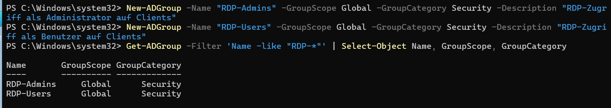

Die Zuweisung habe ich zuerst manuell auf client1 gemacht:

```powershell
Add-LocalGroupMember -Group "Administrators" -Member "CORP\RDP-Admins"
Add-LocalGroupMember -Group "Remote Desktop Users" -Member "CORP\RDP-Users"
```

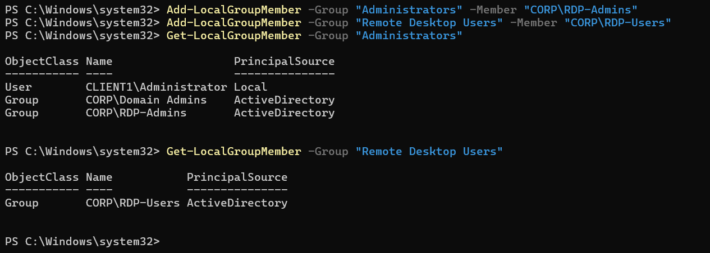

In einer produktiven Umgebung würde man diese Zuweisung zentral über eine Gruppenrichtlinie
verteilen. Wer RDP-Zugriff erhalten soll, wird künftig einfach Mitglied der passenden
Gruppe.
