# Freigaben, Laufwerke und Berechtigungen

Dokumentation zu Auftrag 04: Benutzer und Gruppen, Ordner- und Freigabestruktur,
NTFS-Berechtigungen, ABE und ein AGDLP-Konzept. Aufgabenstellung siehe
[Modul-Repository](https://gitlab.com/ch-tbz-it/Stud/m159/-/tree/main/03-auftraege/04-freigaben-laufwerke-berechtigungen).

Autor: Giacomo Betsch, Klasse Pe24d

Die Werte stammen aus meiner [Planung](../01-planung/planung.md). Passwörter stehen nicht in
diesem Repository.

## 1. Benutzer und Gruppen

Für die vier Abteilungen aus der Planung habe ich je eine globale Sicherheitsgruppe angelegt,
dazu die Gruppen `Intern` (Sekretariat, Buchhaltung, GL) und `Extern` (Promoter):

```powershell
foreach ($g in "GL","Sekretariat","Buchhaltung","Promoter","Intern","Extern") {
    New-ADGroup -Name $g -GroupScope Global -GroupCategory Security
}

New-ADUser -Name "Jasmin Müller" -GivenName "Jasmin" -Surname "Müller" -SamAccountName jmueller -UserPrincipalName "jmueller@corp.m159giacomo.dynv6.net" -AccountPassword $pw -Enabled $true
New-ADUser -Name "Tom Bucher" -GivenName "Tom" -Surname "Bucher" -SamAccountName tbucher -UserPrincipalName "tbucher@corp.m159giacomo.dynv6.net" -AccountPassword $pw -Enabled $true
New-ADUser -Name "Sara Lehmann" -GivenName "Sara" -Surname "Lehmann" -SamAccountName slehmann -UserPrincipalName "slehmann@corp.m159giacomo.dynv6.net" -AccountPassword $pw -Enabled $true
New-ADUser -Name "Kevin Promoter" -GivenName "Kevin" -Surname "Promoter" -SamAccountName kpromoter -UserPrincipalName "kpromoter@corp.m159giacomo.dynv6.net" -AccountPassword $pw -Enabled $true

Add-ADGroupMember -Identity Sekretariat -Members jmueller
Add-ADGroupMember -Identity Buchhaltung -Members tbucher
Add-ADGroupMember -Identity GL -Members slehmann
Add-ADGroupMember -Identity Promoter -Members kpromoter
Add-ADGroupMember -Identity Intern -Members Sekretariat, Buchhaltung, GL
Add-ADGroupMember -Identity Extern -Members Promoter
```

Beim ersten Versuch lehnte die Domäne das Passwort wegen der Komplexitätsrichtlinie ab. Mit
einem längeren, zufälligen Passwort hat es geklappt. Die Kontrolle zeigt die korrekte
Gruppenzugehörigkeit:

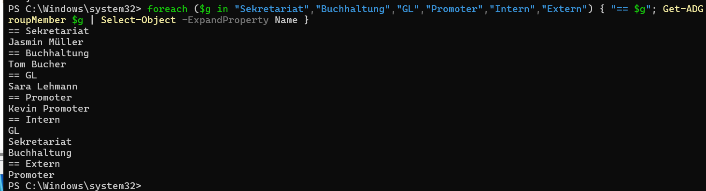

Alle vier Benutzer sind aktiv:

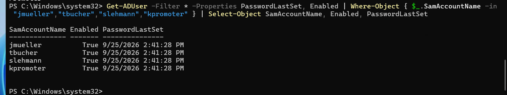

Im Active Directory sind die Benutzer und Gruppen im Ordner *Users* sichtbar:

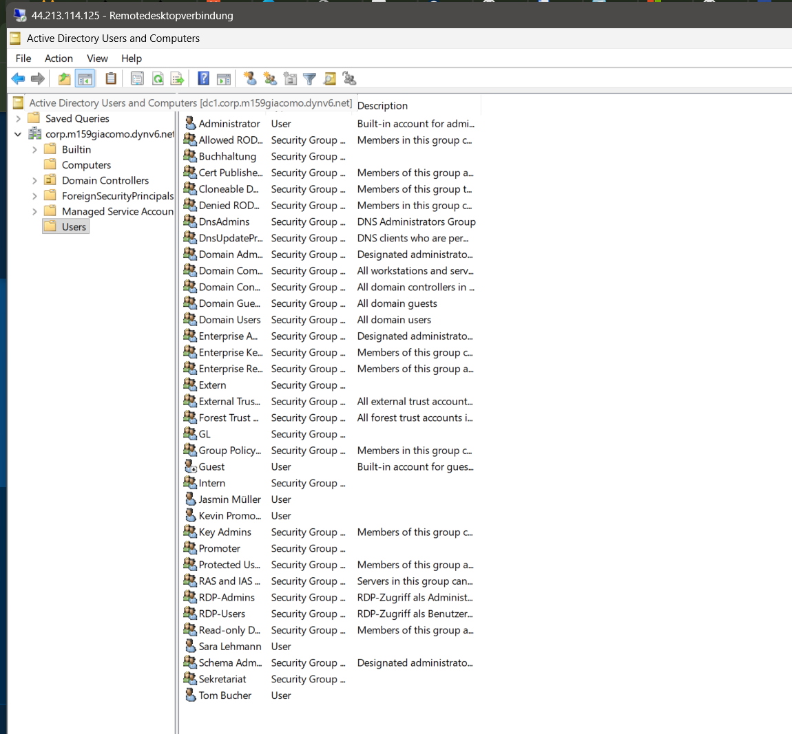

## 2. Ordner und Freigaben

Die Ordnerstruktur und die Freigaben, jeweils mit Freigabeberechtigung «Jeder = Ändern» auf
Freigabeebene:

```powershell
$ordner = "C:\Daten","C:\Daten\Pool","C:\Daten\Abteilungen","C:\Daten\Abteilungen\GL","C:\Daten\Abteilungen\Sekretariat","C:\Daten\Abteilungen\Buchhaltung","C:\Daten\Abteilungen\Promoter","C:\Daten\Intern","C:\Daten\Extern"
foreach ($p in $ordner) { New-Item -ItemType Directory -Path $p -Force | Out-Null }

$freigaben = @{ Daten="C:\Daten"; Pool="C:\Daten\Pool"; Abteilungen="C:\Daten\Abteilungen"; Intern="C:\Daten\Intern"; Extern="C:\Daten\Extern" }
foreach ($f in $freigaben.GetEnumerator()) { New-SmbShare -Name $f.Key -Path $f.Value -ChangeAccess "Everyone" | Out-Null }
```

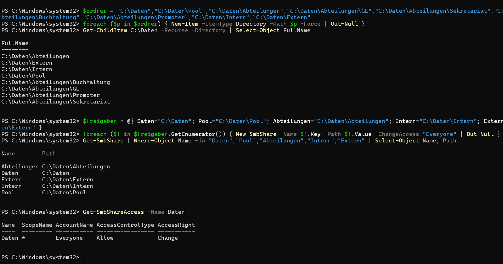

Die Freigaben bekommen bewusst alle «Jeder = Ändern» auf Freigabeebene. Eingeschränkt wird
über die NTFS-Berechtigungen im nächsten Schritt, weil beim Zugriff jeweils die strengere der
beiden Berechtigungen gilt.

## 3. NTFS-Berechtigungen

Auf jedem Ordner habe ich zuerst die Vererbung entfernt (ohne die geerbten Einträge zu
übernehmen) und danach die Rechte aus der Berechtigungsmatrix für meine Abteilungen gesetzt:

| Ordner | Rechte |
| --- | --- |
| `C:\Daten` | GL: Ändern, Buchhaltung: Ändern |
| `C:\Daten\Pool` | GL, Sekretariat, Buchhaltung, Promoter: Ändern |
| `C:\Daten\Abteilungen` | GL: Ändern, Sekretariat/Buchhaltung/Promoter: Lesen |
| `…\Abteilungen\GL` | GL: Ändern |
| `…\Abteilungen\Sekretariat` | GL: Ändern, Sekretariat: Ändern, Promoter: Lesen |
| `…\Abteilungen\Buchhaltung` | GL: Ändern, Buchhaltung: Ändern, Sekretariat/Promoter: Lesen |
| `…\Abteilungen\Promoter` | GL: Ändern, Promoter: Ändern |
| `C:\Daten\Intern` | GL: Ändern, Intern: Ändern |
| `C:\Daten\Extern` | GL: Ändern, Extern: Ändern |

```powershell
$ntfs = [ordered]@{
  "C:\Daten"                          = @{ GL="M"; Buchhaltung="M" }
  "C:\Daten\Pool"                     = @{ GL="M"; Sekretariat="M"; Buchhaltung="M"; Promoter="M" }
  "C:\Daten\Abteilungen"              = @{ GL="M"; Sekretariat="RX"; Buchhaltung="RX"; Promoter="RX" }
  "C:\Daten\Abteilungen\GL"           = @{ GL="M" }
  "C:\Daten\Abteilungen\Sekretariat"  = @{ GL="M"; Sekretariat="M"; Promoter="RX" }
  "C:\Daten\Abteilungen\Buchhaltung"  = @{ GL="M"; Buchhaltung="M"; Sekretariat="RX"; Promoter="RX" }
  "C:\Daten\Abteilungen\Promoter"     = @{ GL="M"; Promoter="M" }
  "C:\Daten\Intern"                   = @{ GL="M"; Intern="M" }
  "C:\Daten\Extern"                   = @{ GL="M"; Extern="M" }
}
foreach ($pfad in $ntfs.Keys) {
  icacls $pfad /inheritance:r | Out-Null
  icacls $pfad /grant "SYSTEM:(OI)(CI)F" "BUILTIN\Administrators:(OI)(CI)F" | Out-Null
  foreach ($g in $ntfs[$pfad].Keys) { icacls $pfad /grant "CORP\${g}:(OI)(CI)$($ntfs[$pfad][$g])" | Out-Null }
}
```

Kontrolle für alle neun Ordner, ohne geerbte Einträge und ohne die Standardgruppe
`BUILTIN\Users`:

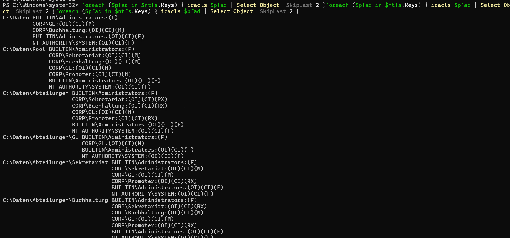

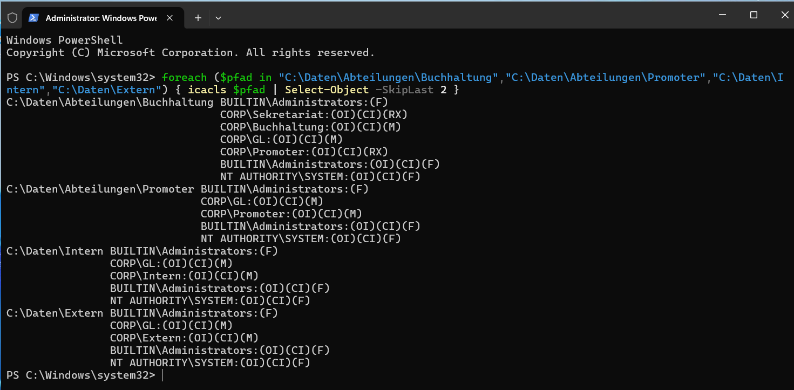

## 4. Berechtigungen testen

Getestet habe ich mit drei verschiedenen Benutzern per RDP auf client1 (Anmeldung als
`CORP\<Benutzername>`). Dafür habe ich die Abteilungsgruppen zuerst in die Gruppe
`RDP-Users` aus Auftrag 03 aufgenommen, damit die Testbenutzer sich überhaupt per RDP anmelden
dürfen:

```powershell
Add-ADGroupMember -Identity RDP-Users -Members Sekretariat, Buchhaltung, GL, Promoter
```

**Sekretariat (jmueller) auf `\\dc1\Abteilungen\Buchhaltung`:** Der Ordner lässt sich öffnen
(Leserecht), das Ablegen einer Datei wird mit "Destination Folder Access Denied" abgelehnt:

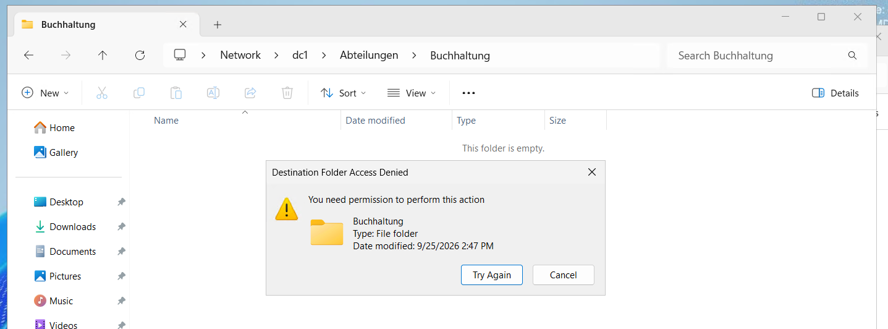

**GL (slehmann) auf `\\dc1\Pool`:** Eine Textdatei lässt sich anlegen (Schreibrecht):

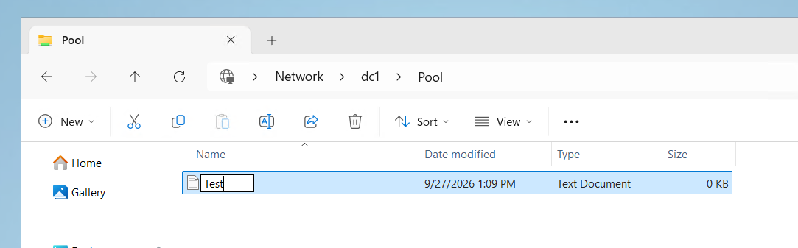

**Promoter (kpromoter) auf `\\dc1\Abteilungen\GL`:** Zugriff wird vollständig verweigert
("You do not have permission to access \\dc1\Abteilungen\GL"):

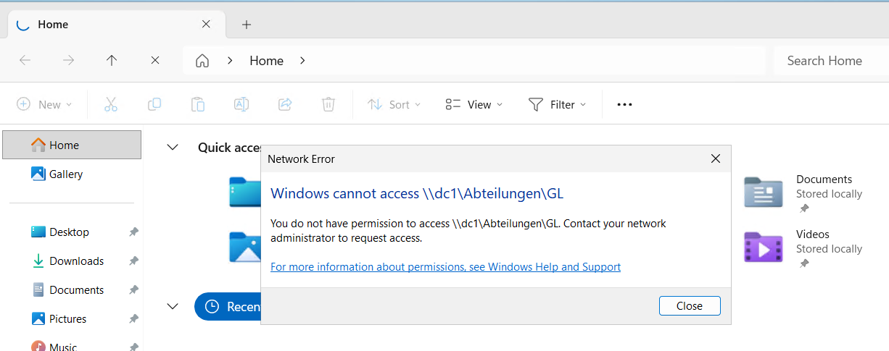

Alle drei Tests entsprechen der geplanten Matrix.

## 5. ABE (Access-Based Enumeration)

ABE blendet Ordner, auf die ein Benutzer keinen Zugriff hat, in der Freigabe aus, statt nur
den Zugriff zu verweigern. Aktiviert auf allen fünf Freigaben:

```powershell
foreach ($f in "Daten","Pool","Abteilungen","Intern","Extern") { Set-SmbShare -Name $f -FolderEnumerationMode AccessBased -Force }
```

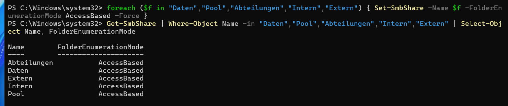

## 6. Group-Nesting-Konzept (AGDLP)

### Schwachstelle der bisherigen Struktur

Die Abteilungsgruppen (`Sekretariat`, `Buchhaltung`, `GL`, `Promoter`) haben aktuell direkt
NTFS-Rechte auf mehreren Ordnern. Das wird unübersichtlich, sobald mehr Ordner dazukommen: Bei
jeder Änderung muss man auf jedem betroffenen Ordner die Berechtigungen einzeln anpassen.

### AGDLP-Prinzip

Benutzerkonten (**A**ccount) werden Mitglied einer globalen Gruppe pro Rolle/Abteilung
(**G**lobal). Die globalen Gruppen werden Mitglied einer domänenlokalen Gruppe pro
Zugriffsart (**DL**). Nur die domänenlokale Gruppe erhält die NTFS-Berechtigung
(**P**ermission) auf dem Ordner. Wer worauf Zugriff hat, steuert man danach nur noch über die
Gruppenmitgliedschaft, nicht mehr über die NTFS-Rechte selbst.

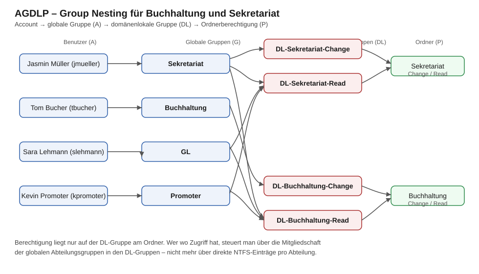

### Umsetzung für Buchhaltung und Sekretariat

```powershell
New-ADGroup -Name "DL-Buchhaltung-Change" -GroupScope DomainLocal -GroupCategory Security
New-ADGroup -Name "DL-Buchhaltung-Read"   -GroupScope DomainLocal -GroupCategory Security
New-ADGroup -Name "DL-Sekretariat-Change" -GroupScope DomainLocal -GroupCategory Security
New-ADGroup -Name "DL-Sekretariat-Read"   -GroupScope DomainLocal -GroupCategory Security

Add-ADGroupMember -Identity DL-Buchhaltung-Change -Members Buchhaltung
Add-ADGroupMember -Identity DL-Buchhaltung-Read   -Members Sekretariat, Promoter, GL
Add-ADGroupMember -Identity DL-Sekretariat-Change -Members Sekretariat
Add-ADGroupMember -Identity DL-Sekretariat-Read   -Members Promoter, GL

icacls "C:\Daten\Abteilungen\Buchhaltung" /remove "CORP\Buchhaltung" "CORP\Sekretariat" "CORP\Promoter" "CORP\GL"
icacls "C:\Daten\Abteilungen\Buchhaltung" /grant "CORP\DL-Buchhaltung-Change:(OI)(CI)M" "CORP\DL-Buchhaltung-Read:(OI)(CI)RX"

icacls "C:\Daten\Abteilungen\Sekretariat" /remove "CORP\Sekretariat" "CORP\Promoter" "CORP\GL"
icacls "C:\Daten\Abteilungen\Sekretariat" /grant "CORP\DL-Sekretariat-Change:(OI)(CI)M" "CORP\DL-Sekretariat-Read:(OI)(CI)RX"
```

GL hat hier bewusst nur noch Lesen statt wie zuvor Ändern, weil die Geschäftsleitung laut
Planung überall Einsicht, aber nicht überall Schreibzugriff braucht.

Die Kontrolle zeigt auf beiden Ordnern nur noch die `DL-…`-Gruppen, keine Abteilungsgruppe
mehr direkt:

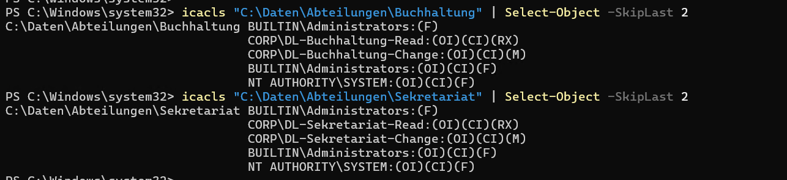

Die restlichen Ordner (`Daten`, `Pool`, `GL`, `Promoter`, `Intern`, `Extern`) sind nicht
umgestellt, das Konzept ist nur für die zwei genannten Abteilungen umgesetzt, wie im Auftrag
verlangt.
