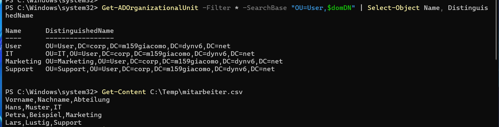
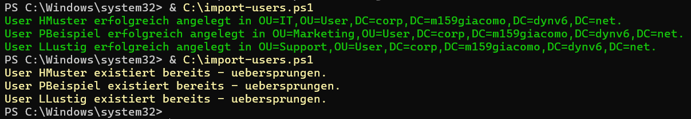
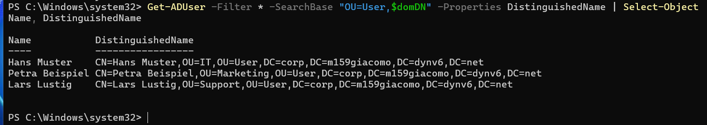

# Identity Management und PowerShell-Debugging

Dokumentation zu Auftrag 09: ein fehlerhaftes Skript für den automatisierten Benutzerimport
analysieren, reparieren und um eine Existenzprüfung erweitern. Aufgabenstellung siehe
[Modul-Repository](https://gitlab.com/ch-tbz-it/Stud/m159/-/tree/main/03-auftraege/09-automation-und-debugging).

Autor: Giacomo Betsch, Klasse Pe24d

Domäne: `corp.m159giacomo.dynv6.net` (`DC=corp,DC=m159giacomo,DC=dynv6,DC=net`), siehe
[Planung](../01-planung/planung.md).

## 1. Vorbereitung

Direkt unter der Domain-Wurzel habe ich die OU `User` angelegt, darin die drei
Abteilungs-OUs `IT`, `Marketing` und `Support`. Dazu den Ordner `C:\Temp` mit der
CSV-Datei `mitarbeiter.csv` (kommagetrennt, wie im Auftrag vorgegeben):

```powershell
Import-Module ActiveDirectory
$domDN = "DC=corp,DC=m159giacomo,DC=dynv6,DC=net"

New-ADOrganizationalUnit -Name "User" -Path $domDN
New-ADOrganizationalUnit -Name "IT" -Path "OU=User,$domDN"
New-ADOrganizationalUnit -Name "Marketing" -Path "OU=User,$domDN"
New-ADOrganizationalUnit -Name "Support" -Path "OU=User,$domDN"

New-Item -ItemType Directory -Path C:\Temp -Force | Out-Null
@"
Vorname,Nachname,Abteilung
Hans,Muster,IT
Petra,Beispiel,Marketing
Lars,Lustig,Support
"@ | Set-Content -Path C:\Temp\mitarbeiter.csv -Encoding UTF8
```



## 2. Fehlerprotokoll

Das ursprüngliche Skript ([import-users.ps1](https://gitlab.com/ch-tbz-it/Stud/m159/-/blob/main/03-auftraege/09-automation-und-debugging/import-users.ps1))
enthielt fünf Fehler:

| # | Problem | Korrektur |
| --- | --- | --- |
| 1 | Trennzeichen-Konflikt: `Import-CSV … -Delimiter ";"`, die CSV ist aber kommagetrennt | Delimiter auf `","` geändert |
| 2 | String-Handling: `$row.Abteilung` und `$row.Vorname $row.Nachname` standen in doppelten Anführungszeichen, ohne Sub-Expression-Operator. PowerShell löst darin nur `$row` auf, der Rest bleibt Literal-Text | Mit `$( )` umschlossen: `$($row.Abteilung)`, `$($row.Vorname) $($row.Nachname)` |
| 3 | AD-Pfade: Platzhalter-Domain `DC=it-tbz,DC=local` im UPN und im OU-Pfad | Ersetzt durch die tatsächliche Domain `DC=corp,DC=m159giacomo,DC=dynv6,DC=net` |
| 4 | Passwort-Konvertierung: `ConvertFrom-SecureString` wandelt einen SecureString in einen verschlüsselten Text um — die falsche Richtung für `-AccountPassword` | Durch `ConvertTo-SecureString "Schule123" -AsPlainText -Force` ersetzt, das wandelt Klartext in einen SecureString um |
| 5 | OU-Logik: `$targetOU` zeigte wegen der Fehler 2 und 3 ins Leere (Literal-Text statt Wert, falsche Domain) | Nach den Korrekturen ergibt sich korrekt `OU=<Abteilung>,OU=User,DC=corp,DC=m159giacomo,DC=dynv6,DC=net`, passend zur angelegten Struktur |

Zusätzlich aus Teil B ergänzt: Vor dem Anlegen prüft das Skript mit `Get-ADUser`, ob der
`sAMAccountName` schon existiert. Existiert er, gibt es eine gelbe Warnung und der Eintrag wird
übersprungen; sonst wird der Benutzer angelegt und eine grüne Erfolgsmeldung ausgegeben.

## 3. Repariertes Skript

```powershell
Import-Module ActiveDirectory

$csvPath = "C:\Temp\mitarbeiter.csv"
$users = Import-CSV $csvPath -Delimiter ","

foreach ($row in $users) {

    $sAMAccountName = $row.Vorname.Substring(0,1) + $row.Nachname
    $userPrincipalName = "$sAMAccountName@corp.m159giacomo.dynv6.net"
    $targetOU = "OU=$($row.Abteilung),OU=User,DC=corp,DC=m159giacomo,DC=dynv6,DC=net"

    $existing = Get-ADUser -Filter "SamAccountName -eq '$sAMAccountName'" -ErrorAction SilentlyContinue

    if ($existing) {
        Write-Host "User $sAMAccountName existiert bereits - uebersprungen." -ForegroundColor Yellow
    } else {
        New-ADUser -Name "$($row.Vorname) $($row.Nachname)" `
                   -SamAccountName $sAMAccountName `
                   -UserPrincipalName $userPrincipalName `
                   -Path $targetOU `
                   -AccountPassword (ConvertTo-SecureString "Schule123" -AsPlainText -Force) `
                   -Enabled $true

        Write-Host "User $sAMAccountName erfolgreich angelegt in $targetOU." -ForegroundColor Green
    }
}
```

## 4. Ausführung: Anlegen und Überspringen

Das Skript zweimal ausgeführt: beim ersten Durchlauf werden die drei Benutzer angelegt
(grüne Meldungen), beim zweiten Durchlauf erkennt die Existenzprüfung, dass sie schon da
sind, und überspringt sie mit gelber Warnung. Damit sind beide Zweige aus Teil B belegt:



## 5. Erfolgsnachweis

Die drei Benutzer sind in ihren jeweiligen Abteilungs-OUs angelegt:

```powershell
Get-ADUser -Filter * -SearchBase "OU=User,$domDN" -Properties DistinguishedName | Select-Object Name, DistinguishedName
```



- Hans Muster → `OU=IT,OU=User,…`
- Petra Beispiel → `OU=Marketing,OU=User,…`
- Lars Lustig → `OU=Support,OU=User,…`
